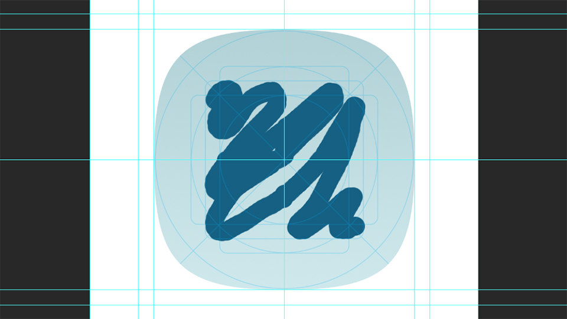

# Adaptive Icons Guide

A guide on creating adaptive icons for Android.

* Supports masks: `square`, `rounded square`, `squircle`, `teardrop`, `circle`
* Keyline guides
* Sample foreground and background

## TODO:

* Legacy icon masks
  * square mask
  * rounded square mask
  * circle mask
* iOS icon mask

## License

This whole project (the `.PSD` guide and all other files) is licensed with a [**CC BY-ND 4.0**](https://creativecommons.org/licenses/by-nd/4.0/) license.

It means that you are free to copy and redistribute the material in any medium or format for any purpose, even commercially under the following terms:

* **Attribution** - you must have a link back to this page.
* **No derivatives** - if you change the material, you may not distribute the modified material.

To learn more about this license, it's freedoms, and restrictions, please check the following resources:

* [Attribution-NoDerivatives 4.0 International (CC BY-ND 4.0)](https://creativecommons.org/licenses/by-nd/4.0/)
* [Full CC BY-ND 4.0 legal code](https://creativecommons.org/licenses/by-nd/4.0/legalcode)

---

**Important!** The above mentioned license **only covers the `.PSD` guide** and its accompanying files.

Whatever you create with it, on the other hand, can be used, licensed, distributed, sold, or given away at your full discretion.

It's solely up to you.

---

## Support

If you find this useful, please support my work by becoming a patron on Patreon.

Also, check out [the articles on my blog](https://jap.alekhin.io).

## Getting Started

1. Clone or download this repository.
0. Open the `launcher-icon.psd` in Photoshop.
0. Hide or delete the layers inside the `foregrounds` folder.
0. Add a layer either inside or above the `foregrounds` folder.
0. Work on your awesome adaptive icon (don't forget about the background).
0. Hide or show masks to preview how your adaptive icon might look like.
0. Apply it to the app you're working on.
0. Profit!

You can follow the same steps for making a Google Play Store icon.

## Contributing

If you want, you can contribute sample icons, optimized measurements, keylines, and guides. If you have any issues, comments or suggestion, please file an issue.

1. Clone this repository
0. Make your changes
0. Submit a pull request
